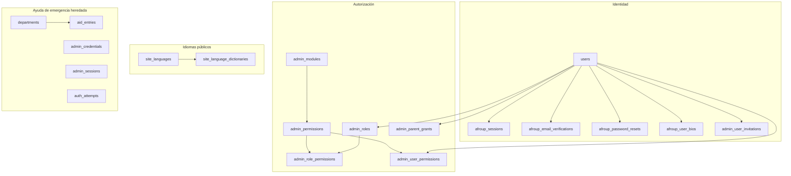
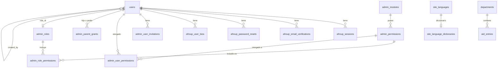
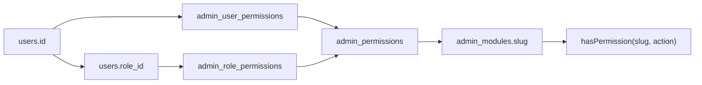
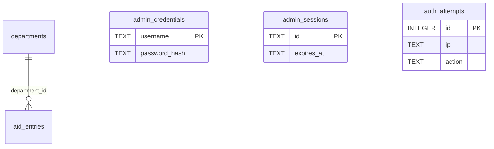

# Esquema D1 de AfroUp

La base de datos Cloudflare D1 `afroup-db` (binding `DB`) almacena identidad, permisos, idiomas públicos y el catálogo heredado de ayuda de emergencia. Este documento describe el **esquema local después de `0020_unified_users`**. Beta y producción aún requieren esa migración antes de coincidir con esta estructura.

## Ruta rápida

1. Una persona equivale a una fila en `users`.
2. Los roles y las concesiones de permisos se desprenden de ese `id`.
3. Las sesiones, biografías, invitaciones y restablecimientos se propagan en cascada desde `users`.
4. Los idiomas y las tablas de ayuda de emergencia son catálogos separados.

## Bases de datos

| Binding | Nombre | Rol |
|---|---|---|
| `DB` | `afroup-db` | Esquema de la aplicación documentado aquí |
| `AVATARS` | `afroup-avatars` | Objetos R2, no SQL. Las URLs de avatares residen en `users.avatar_url` |
| `MEDIA` | `afroup-media` | Objetos R2. Portadas de artículos, ilustraciones y recursos multimedia |
| `DOCUMENTS` | `afroup-documents` | Objetos R2. Documentos PDF, investigaciones y recursos descargables |

ID local: `7b41bfc3-d3f0-4eb0-a89f-c3111dbb4ecb`. Beta utiliza `afroup-db-beta`. Aplique los archivos numerados en `migrations/` en orden.

## Mapa de dominios

## Relaciones

Las flechas continuas representan claves foráneas declaradas. La línea punteada `created_by` es una relación a nivel de aplicación: la columna existe, pero `0020` no añade `REFERENCES users(id)`.

## Detalles

| Área | Decisión |
|---|---|
| Identidad | Una única tabla `users`. `afroup_users` y `admin_users` han sido eliminadas localmente. |
| Inicio de sesión | Correo electrónico + contraseña en `users`. Cookie `afroup_session` → `afroup_sessions.token`. |
| Permisos predeterminados | Cada persona recibe `users:read` y `users:update`. |
| Slug del módulo | El slug en el catálogo es `users`. La URL de administración se mantiene en `/admin/usuarios`. |
| Ayuda heredada | Permanece en este D1. La aplicación actual de Astro no gestiona esta superficie de producto. |
| Autenticación no utilizada | `admin_credentials` y `admin_sessions` permanecen del Worker anterior. No las utilice para `/cuenta`. |

## Identidad

### `users`

Una persona. El perfil público, contraseña, rol, estado de invitación y creador residen aquí.

| Columna | Tipo | Notas |
|---|---|---|
| `id` | INTEGER PK | Se conservan los IDs públicos anteriores a `0020` |
| `name` | TEXT NOT NULL | |
| `email` | TEXT NOT NULL UNIQUE | Una persona por correo electrónico |
| `password_hash` | TEXT | Nulo únicamente mientras `invite_pending = 1` |
| `verified_at` | TEXT | Nulo hasta la verificación de correo o aceptación de invitación |
| `bio` | TEXT | Biografía en el idioma principal |
| `avatar_url` | TEXT | URL pública hacia R2 |
| `role_id` | INTEGER → `admin_roles.id` SET NULL | Opcional |
| `is_active` | INTEGER NOT NULL DEFAULT 1 | `0` o `1` |
| `invite_pending` | INTEGER NOT NULL DEFAULT 0 | `0` o `1` |
| `created_by` | INTEGER | Otro `users.id`. No es una clave foránea restringida por base de datos |
| `created_at` | TEXT NOT NULL | |
| `updated_at` | TEXT NOT NULL | |

Índices: `idx_users_invite_pending`, `idx_users_created_by`.

### Sesión y tokens

| Tabla | PK | FK | Propósito |
|---|---|---|---|
| `afroup_sessions` | `token` | `user_id` → `users.id` CASCADE | Sesión activa en cookie, 30 días |
| `afroup_email_verifications` | `token` | `user_id` → `users.id` CASCADE | Verificación de registro |
| `afroup_password_resets` | `token` | `user_id` → `users.id` CASCADE | Restablecimiento de contraseña de una hora |
| `admin_user_invitations` | `token` | `user_id` → `users.id` CASCADE | Aceptación de invitación |
| `afroup_user_bios` | `(user_id, locale)` | `user_id` → `users.id` CASCADE | Contenido de biografía por idioma |

`users.bio` contiene el idioma principal. `afroup_user_bios` almacena las traducciones. Los campos de idioma vacíos no deben persistir el texto principal como si fuese una traducción.

## Autorización

El acceso efectivo es **concesión directa O concesión por rol**. Cada celda de concesión también puede incluir:

| Flag | Significado |
|---|---|
| `parent` | Ver/administrar la cadena de creadores, no solo a sí mismo y las filas propias |
| `quota` | Límite numérico. Nulo significa sin límite |
| `translate_manual` | Puede escribir traducciones manualmente |
| `translate_ai` | Puede invocar Workers AI |
| `translate` | Modo exclusivo heredado (`none\|manual\|ai`). Las comprobaciones activas usan los dos flags anteriores |

### Catálogo

| Tabla | PK | Notas |
|---|---|---|
| `admin_modules` | `id` | `slug` único. El nombre a mostrar puede mantenerse en español (`Usuarios`) |
| `admin_permissions` | `id` | `(module_id, action)` único y `name` único (`users:update`) |
| `admin_roles` | `id` | Datos semilla: Administrador, Editor, Moderador |
| `admin_role_permissions` | `(role_id, permission_id)` | Valores predeterminados del rol |
| `admin_user_permissions` | `(user_id, permission_id)` | Sobrescrituras por persona |
| `admin_parent_grants` | `(child_id, parent_id, action)` | Relaciones jerárquicas adicionales. `child_id != parent_id` |

Los slugs de módulos inicializados (semilla) incluyen `articulos`, `comentarios`, `proyectos`, `almacenamiento`, `users` (anteriormente `usuarios`), `modulos`, `permisos`, `roles`, `idiomas`, `traduccion`. Las acciones son `create`, `read`, `update`, `delete`.

## Idiomas públicos

| Tabla | PK | Notas |
|---|---|---|
| `site_languages` | `code` | `is_visible`, `is_pillar`, `sort_order`. `es` y `en` son pilares |
| `site_language_dictionaries` | `code` → `site_languages.code` CASCADE | Diccionario de interfaz de usuario en JSON |

Cero o un idioma visible oculta el selector público. Dos muestran un interruptor de siglas. Tres o más muestran un menú desplegable (`select`). La interfaz de administración se mantiene únicamente en español/inglés.

## Editorial y búsqueda

| Tabla | PK | Notas |
|---|---|---|
| `article_categories` | `id` | Categoría con `slug`, `created_by` y timestamps |
| `article_category_locales` | `(category_id, locale)` | Título, descripción y `og_json` (Open Graph / Twitter) por idioma |
| `articles` | `id` | `slug`, `created_by`, `status` (`draft\|published`), `published_at`, `cover_image_url`, `reading_time_minutes`, `created_at`, `updated_at` |
| `article_locales` | `(article_id, locale)` | `title`, `description` (corta/dek), `content_html` (rich text) y `og_json` por idioma |
| `article_category_map` | `(article_id, category_id)` | Relación muchos a muchos con `sort_order` |
| `article_tags` | `(article_id, tag)` | Etiquetas asociadas por artículo |
| `tags` | `id` | Catálogo global de etiquetas con `name` y `slug` únicos para autocompletado y búsqueda |
| `about_page_locales` | `locale` | Contenido editorial, misión, visión, equipo, estadísticas y CTA de `/nosotros` por idioma |
| `contact_page_locales` | `locale` | Canales oficiales, hero, respuesta y metadatos de `/contacto` por idioma |
| `contact_submissions` | `id` | Bandeja de mensajes de contacto recibidos con estado (`unread|read|replied|archived`) |
| `resources` | `id` | Catálogo de recursos educativos con `slug` único, tipo (`pdf|web|mapa|lectura|audio`), `category_tag`, `file_url`, `status`, `featured`, `sort_order` |
| `resource_locales` | `(resource_id, locale)` | Título, descripción (`dek`), contenido HTML y metadatos `og_json` por idioma |
| `resources_page_locales` | `locale` | Configuración de cabecera (hero) y banner de colaboración de `/recursos` por idioma |
| `collaborate_skills` | `id` | Perfiles y habilidades para voluntariado comunitario con `slug`, `icon`, `badge_color`, `status` y `sort_order` |
| `collaborate_skill_locales` | `(skill_id, locale)` | Título y descripción breve de la habilidad por idioma |
| `collaborate_page_locales` | `locale` | Hero, títulos y notas del formulario de `/colabora` por idioma |
| `collaborate_submissions` | `id` | Bandeja de postulaciones recibidas con datos del candidato, rol deseado, mensaje, notas y estado (`unread|read|contacted|archived`) |
| `referentes` | `id` | Catálogo de figuras y referentes históricos y contemporáneos con `slug` único, `category_tag`, `badge_theme`, `photo_url`, `years_active`, `status`, `featured` y `sort_order` |
| `referente_locales` | `(referente_id, locale)` | Nombre, rol, fechas, biografía completa (`bio_html`), cita (`quote`), hitos cronológicos (`milestones_json`) y metadatos `og_json` por idioma |
| `referentes_page_locales` | `locale` | Configuración de cabecera (hero) y banner de propuesta («¿Falta alguien?») de `/referentes` por idioma |
| `projects` | `id` | Catálogo de iniciativas con `slug` único, `organization`, `stage` (`borrador|en_revision|aprobado`), `budget_currency`, `budget_amount`, `start_date`, `status`, `featured` y `sort_order` |
| `project_locales` | `(project_id, locale)` | Nombre, resumen (`dek`), descripción HTML y metadatos `og_json` por idioma |
| `projects_page_locales` | `locale` | Configuración de cabecera (hero) y banda de propuesta de `/proyectos` por idioma |
| `search_documents` | `id` | Índice unificado para `/buscar` con `(module_slug, record_id, locale)` único |

## Ayuda de emergencia heredada

Estas tablas aún existen. Pertenecen al producto anterior de Worker/guía, no a la identidad actual de cuenta/administración en Astro.

| Tabla | PK | Notas |
|---|---|---|
| `departments` | `id` | `slug` único |
| `aid_entries` | `id` | `department_id` → `departments.id`. `status` en `published\|pending\|rejected`. Columna adicional `information` de migraciones posteriores |
| `admin_credentials` | `username` | Almacén de contraseñas del Worker anterior |
| `admin_sessions` | `id` | Sesiones del Worker anterior |
| `auth_attempts` | `id` | Registro de limitación de tasa por IP + acción |

## Lista de verificación

- [ ] La base D1 local tiene `users` y no tiene `afroup_users` / `admin_users`
- [ ] Las concesiones de permisos e invitaciones apuntan a `users.id`
- [ ] Las sesiones por cookie continúan usando `afroup_sessions`
- [ ] Los avatares permanecen en R2; solo la URL está en SQL
- [ ] No tratar `admin_credentials` como la tabla de inicio de sesión actual

## Siguiente paso

Mantenga este archivo sincronizado cuando una migración añada o elimine una tabla. Tras aplicar `0020` en remoto, beta y producción coincidirán con este documento.
